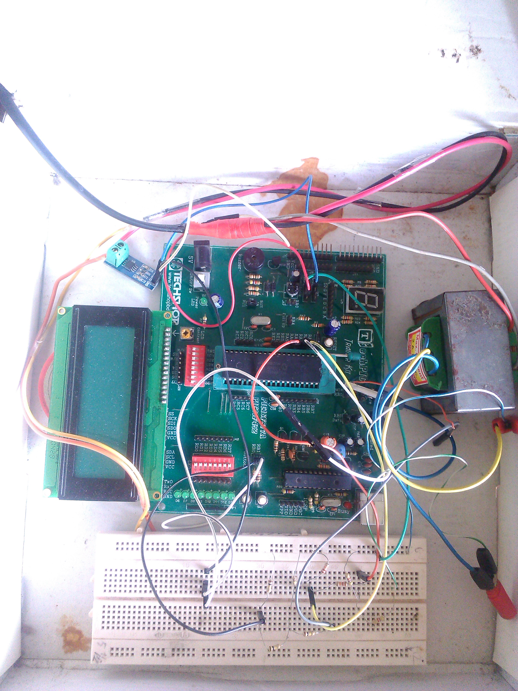

# Embedded_System_3rd_Year_Projects
AC parameter measurement is one of the most important task in laboratory to study about different machines, three phase line, the electronics etc. and industry to measure power, voltage, frequency, current for the industrial safety and control. This low cost device is capable of measuring AC parameter voltage, current, frequency, power factor, power, energy with only a small error and this error can be removed by proper calibration. This low cost and small size device is capable of carrying anywhere and easy to operate.

# AC Voltage Measurement
To measure 220V AC, it is necessary to step down this voltage. Because microcontrollers can’t measure voltage greater than 5V. If it was given voltage more than 5V to analog input of microcontroller, it will get damage permanently. To assure protection of microcontroller, it is need to step down 220 volt AC into AC voltage whose peak value should be less than 5V. For example 220V AV mean RMS voltage and its peak value is equal to 311 volt. Similarly it have to step down high AC voltage of in such a way that its peak value should not be greater than 5 volt. Voltage divider circuit as it name suggests is used to divide voltage. Two resistors are used to as voltage divider. Potential transformer step downs 220 volt AC in to 12 volt AC.  But microcontroller cannot read voltage more than 5 volt. Therefore voltage divider circuit further divide the voltage in two parts and less than 5 volt appear across analog to digital converter pin of pic microcontroller.PIC18f452 can measure voltage from ac input. It has the capability to handle ac voltage but less than 5V.

Input to circuit is 220 volt AC voltage. Potential transformer step downs 220 volt AC voltage in 12 volt AC. Voltage divider further divides the voltage into two parts. Voltage less than 5 volt appear across analog to digital converter pin of pic18f452 microcontroller. Microcontrollers are basically small microcomputers which understand only digital values. Built in analog to digital converter module of microcontroller converts analog values of AC voltage into digital values. These digital values are used in processing of data with in microcontroller. Pieces of instructions written in the form of coding told microcontroller what to do. Microcontroller itself do not do anything. You tell him to do whatever you want him to perform by writing pieces of information called program.

 An analog-to-digital converter (ADC, A/D, or A to D) is a device that converts a continuous physical quantity (usually voltage) to a digital number that represents the quantity's amplitude. The conversion involves quantization of the input, so it necessarily introduces a small amount of error. Instead of doing a single conversion, an ADC often performs the conversions ("samples" the input) periodically. The result is a sequence of digital values that have been converted from a continuous-time and continuous-amplitude analog signal to a discrete-time and discrete-amplitude digital signal. The PIC18f452 has 10bit ADC of 10 channel build in the IC chip. For voltage measurement channel 1 is selected and read the ADC value after 5 millisecond and totally 100 times. Than the average ADC value is measured and multiplied by required quantity that was calibrated before. The circuit diagram is shown in the figure and the coding is provided than. 

 # AC Current Measurement 
Allegro Microsystems’ ACS712 integrated circuit, allows measurement of current -direct or alternating- flowing in a conductor. The desired measured current generates a magnetic field which the sensor converts to a proportional output voltage, using the Hall Effect. This voltage in turn is read by a microcontroller system through an A/D converter to calculate its peak value and the corresponding RMS value of the load current.

For this project, the test equipment shown in the photo above was used. A program in ANSI C for Bolt 18F452 system, which reads the analog voltage signal generated by the sensor and displays the ACS712 Irms value in its LCD was developed. In tests, a maximum error of 2% in the measurement is obtained by comparing the values read through the ACS712 and the calibrated current meter.

As test loads, three 60 watts incandescent bulbs connected in parallel were used. The project tests took place in Mexico, where the delivered residential power is 220 VAC, 50Hz. During testing, a calibrated current meter was used to perform comparison with the readings obtained by the microcontroller system. Here, a reading for a load of 120 watts (2 bulbs of 60 watts), with value of 0.962 amperes is shown. The comparison of the two readings gives an error of about 2% for the measurement obtained with the microcontroller system, using the following formula: E = (0.020/0.942) * 100 = 2.12%.
# Frequency Measurement 
A simple frequency counter measures frequency by counting the number of edges of an input signal over a defined period of time (T).A more complex method is counting. Frequency is defined as (Number of events) / (time in seconds) and measured in Hz. To make calculations trivial using a 1 second gate time (T) gives a direct reading of frequency from the edge counter.
# Power Factor Measurement 
The 230 V, 50 Hz is step downed using voltage transformer and Hall Effect current sensor is used to extract the waveforms of current. The output of the voltage transformer is proportional to the voltage across the load and output of current sensor is proportional to the current through the load. These waveforms are fed to Voltage. These outputs are fed to the PIC which does the zero crossing and time measurement the further power factor calculations. PIC 18f452 microcontroller is the heart of this Automatic Power Factor measurement, it find and it displays the calculated power factor in the 16×4 LCD Display. 

The microcontroller interrupt concept is used to calculate the power factor. The output of voltage is connected in pin RB0 and current output is connected in RB1. The pic18f452 is calculate the phase difference using interrupt and timer. 
# Power Measurement
The power is of the load can be calculated by the equation P=V.I.powerfactor.
# Energy Calculation
The energy can be calculated from the parameter by the equation 

